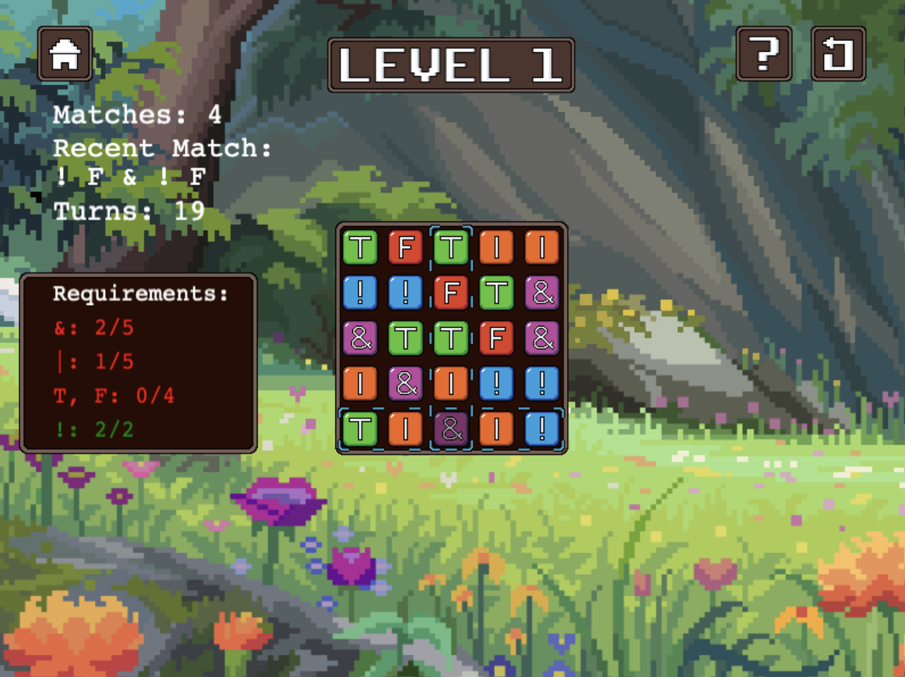

# Game Name

Boolean Bonanza

# Team Color

Navy

# Developers

-   Mercedes Mathews (mmathews@udel.edu)
-   Rana Tuncer (rantun@udel.edu)

# Blurb

Let's be honest: We've all been bored before in class--bored enough to pull open a tab of solitaire or minesweeper and play it rather than listen to the monotonous droning of the professor during lecture. So, what if we took that concept and made it useful? What if we were given the chance to learn about a topic, say, Boolean operations, through a fun game instead of a lengthy class? That's where Boolean Bonanza comes in. A match-based, Candy Crush style game that involves matching logical blocks on a game board to evaluate and create boolean expressions.

# Basic Instructions

Players can traverse the board with WASD keys, and use the arrow keys to shift blocks around. The point is to move the blocks such that the expression in the entire row/column evaluates to true. In order to complete each level, players must meet the requirements of the round before running out of moves.

# Screenshot

# Gameplay Video

Short demo of game

<iframe width="560" height="315" src="https://www.youtube.com/embed/MoIkJmGQfFU?si=8F-u-RALv5qWJxrQ" title="YouTube video player" frameborder="0" allow="accelerometer; autoplay; clipboard-write; encrypted-media; gyroscope; picture-in-picture; web-share" referrerpolicy="strict-origin-when-cross-origin" allowfullscreen></iframe>

# Educational Game Design Document

Link to our [egdd](https://ud-s24-cisc374.github.io/final-project-navy/docs/egdd.html)

# Credits

-   Frog vector image by kyafadhil808412, modified by Rana in Aseprite. <a href="https://www.vecteezy.com/free-vector/sign">Sign Vectors by Vecteezy</a>
-   Background image by 16pxl, modified by Rana in Aseprite. <a href="https://8pxl.tumblr.com/post/712784334718894080/rest-now-youve-earned-it-available-as-a">Link to Image</a>
-   "Bossa Antigua" Kevin MacLeod (incompetech.com)
    Licensed under Creative Commons: By Attribution 4.0 License http://creativecommons.org/licenses/by/4.0/
-   "Funk Game Loop" Kevin MacLeod (incompetech.com)
    Licensed under Creative Commons: By Attribution 4.0 License http://creativecommons.org/licenses/by/4.0/
-   "Miami Viceroy" Kevin MacLeod (incompetech.com)
    Licensed under Creative Commons: By Attribution 4.0 License http://creativecommons.org/licenses/by/4.0/
-   "Thief in the Night" Kevin MacLeod (incompetech.com) Licensed under Creative Commons: By Attribution 4.0 License http://creativecommons.org/licenses/by/4.0/
-   "Vibing Over Venus" Kevin MacLeod (incompetech.com) Licensed under Creative Commons: By Attribution 4.0 License http://creativecommons.org/licenses/by/4.0/
-   "ZigZag" Kevin MacLeod (incompetech.com)
    Licensed under Creative Commons: By Attribution 4.0 License http://creativecommons.org/licenses/by/4.0/
-   "Select Button Sound Effect" Free Gaming Sound Effects https://www.youtube.com/watch?v=KsDg-ggEOvk
-   "Jazz Chords SOUND Effect" SOUND Effects Public Domain https://www.youtube.com/watch?v=7jSUfGcXkDc
-   "Collect Item Sound EFfect" SFX WARD https://www.youtube.com/watch?v=AFYWsbUSasw
