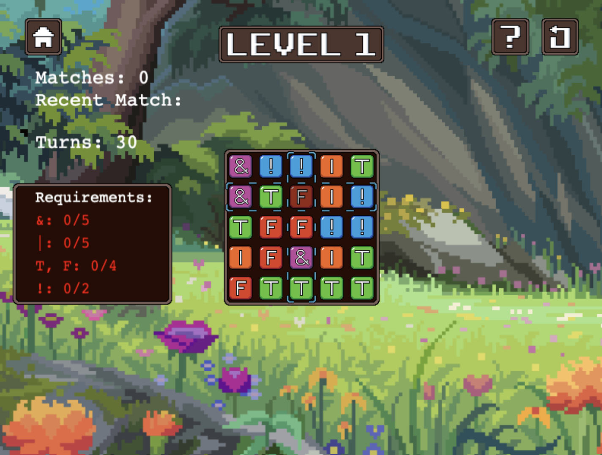

# Boolean Bananza

## Elevator Pitch

Let's be honest: We've all been bored before in class--bored enough to pull open a tab of solitaire or minesweeper and play it rather than listen to the monotonous droning of the professor during lecture. So, what if we took that concept and made it useful? What if we were given the chance to learn about a topic, say, Boolean operations, through a fun game instead of a lengthy class? That's where Boolean Bonanza comes in. A match-based, Candy Crush style game that involves matching logical blocks on a game board to evaluate and create boolean expressions.

## Influences (Brief)

-   _Yoshi's Cookie_:

    -   Medium: _Console Game_
    -   Explanation: _Yoshi's Cookie is our inspiration for determining how objects on the board could be moved. Columns/rows can be shifted vertically or horizontally to change the location of a block (i.e, the game is NOT a drag-and-drop)._

-   _Candy Crush:_:

    -   Medium: _Mobile Game_
    -   Explanation: _Candy Crush is our inspiration for implementing a limited number of moves and required matches in order to complete each level (Ex. You need to get 2 expressions evaluated to True to pass), as well as having a score system that rewards players based off how many moves they took to complete a match._

-   _Sudoku_:
    -   Medium: _Puzzle Game_
    -   Explanation: _Sudoku is our inspiration for the grid-based board layout and how matches can be made (i.e, if the whole row/column is correct, then a match is made)._

## Core Gameplay Mechanics (Brief)

-   _There is an NxN game board containing blocks with various values_
-   _The size of the board increases in advanced levels_
-   _The initial board contains T, F, AND, NOT, and OR blocks, with other blocks being introduced in various levels_
-   _Move around the board with WASD keys_
-   Shift the blocks in each row/column using arrow keys
-   When all the blocks in a row/column evaluate to True or the specified value, a match is made and the row/column disappears
-   New blocks take the place of any that were disappeared from a previous match
-   Players have limited moves, where each time a player moves off of a block whose position was shifted, their moves decrease by one
-   A level is completed if players gather the required amount of specified matches, and lost if players run out of moves before gathering the required amount of specified matches
-   Players who have trouble with understanding the logic behind matches can refer to a help section that offers examples and explanations
-   When a level is completed, an end-of-round screen is shown and they can either replay the level, view the expressions they've created in that level, or return to the level select screen. For those who failed to complete a level, a similar screen will be shown with a message letting the players know they can't move to the next level yet

# Learning Aspects

## Learning Domains

_Introductory comptational/programming logic_

## Target Audiences

-   _Novice programmers with little/no prior programming experience_
-   _Appropriate for all ages_

## Target Contexts

-   _This could be offered as additional practice in a course that teaches conditional logic involving True/False expressions_
-   _The game may also serve as an introduction to conditional logic concepts for unfamiliar players_
-   _Due to the use of audio, it may not be appropriate for a classroom activity_
-   _Because the controls rely on WASD and arrow keys, it may not work for devices that do not have a QWERTY keyboard (i.e, unsuitable for mobile gameplay)_

## Learning Objectives

-   Creating Boolean Expressions: _By the end of the gameplay, players will be able to construct Boolean expressions by chaining together blocks of True, False, And, Or, Not, and other elements/expressions that can be equated to True or False_

-   Evaluating Truthiness: _By the end of the lesson, players will be able to evaluate Boolean expressions and determine whether they equate to True or False_

## Prerequisite Knowledge

-   _Prior to the game, players need to be able to define what Boolean values are_
-   _Prior to the game, players must be able to identify the syntax and meaning of logical operators (Ex. NOT, AND, OR)_

## Assessment Measures

A short pre-test and matching post-test should be designed to assess student learning.

-   _Given a boolean expression, determine whether it will evaluate to True or False_
-   _Create a boolean expression given certain criteria (Ex. Use specific logical operators, make the expression evaluate to a given value)_
-   _Given a boolean expression, explain why the answer does or does not evaluate to the answer that is provided_
-   _Multiple choice questions that test students on how boolean operators work_

# What sets this project apart?

-   _The game doesn't teach players how to code, but prepares them to understand the logic behind conditional expressions_
-   _The game can be played without Computer Science/programming principles in mind, and can be applied to mathematical concepts as well_
-   _The gameplay mechanics of swapping blocks to create a match offer enjoyment beyond simply gaining satisfaction over learning the material_

# Player Interaction Patterns and Modes

## Player Interaction Pattern

_This is a singleplayer game, players use the WASD and arrow keys to navigate through the board in a level, and click with the mouse to traverse the content between levels (Ex. next level button, replay)_

## Player Modes

-   Singleplayer: _You repeatedly advance through levels until you've successfully completed all of them (Levels can be repeated, there is not an official ending screen denoting end of gameplay)_

# Gameplay Objectives

-   Make matches on the board:

    -   Description: _Swap the blocks within a row/column to make the entire line evalate to a specific value_
    -   Alignment: _Completing a match teaches players how to construct Boolean expressions to achieve a desired output, thus teaching them the syntax of the expressions and how chained values interact together_

-   Complete the requirements in each level:

    -   Description: _Finish each round by making matches on the board to meet the level criteria within the given number of moves_
    -   Alignment: _Completing a round indicates players' proficiency in evaluating various Boolean expressions, as the criteria will differ based off of the level (Ex. Round 1 may care about matches involving AND/OR, while Round 2 introduces expressions involving different operations)_

-   Complete all levels:
    -   Description: _Finish every level by meeting all the required criteria in each round. Each level introduces a new concept to work with, and so the requirement/layout of one level will not look the same as another_
    -   Alignment: _Completing all the levels shows mastery in both constructing and evaluating Boolean expressions of varying complexity_

# Procedures/Actions

Players can click on buttons to do the following:

-   _Show similar helpful examples & explain the functionality of various blocks_
-   _Reset/restart the level_
-   _Return to the level select or main menu screen_
-   View the controls for the game
-   View the credits of the game

Players can use keyboard buttons to move across the board and swap the placement of blocks in each level

# Rules

-   _If a player changes a block in a row/column and moves to a different selected block, it takes up a move_
-   _When players click off of a level and click back into it, they resume from where they previously left off_
-   _Selected blocks can only be changed with one in the same row/column (i.e matches can only be made horizontal/vertical, blocks can not be switched diagonally)_
-   _If the player runs out of moves without completing a level, a "round incomplete" screen appears_
-   _The player can click on the help button to gain more insight on the game and making matches_
-   _When a player makes a row/column match, the entire row/column gets removed/disappears)_
-   _Each level incorporates new blocks or increases board size to create advanced Boolean expressions_
    -   T, F, AND, OR, NOT, =, Parentheses\*
    -   Board size: 5x5, 7x7, 9x9\*

# Objects/Entities

-   _There is a game board in the middle of the screen where players will create logical expressions_
-   _There are multicolored blocks within the board that players will combine to make the Boolean expressions_
-   _There is text displaying the number of matches made above the board_
-   _To the left of the board is text showing the number of moves remaining, and required matches needed to complete the level_
-   _There are buttons above the game board to return to the level select screen or restart the level, and a help button to the right of the board_

## Core Gameplay Mechanics (Detailed)

-   NxN game board: _The game board where the matches will be done is a grid-based square board that changes in dimension based off of the current level. Easier/introductory levels will begin on a 5x5 board, and harder levels that introduce new material will have boards that could be 7x7 or 9x9 depending on the content_

-   Moveable blocks in game board: \*The first level board contains T, F, AND, NOT, and OR blocks in a 5x5 grid. This initial board would only consider matches where the row/column equates to True (Ex. the row T & F OR T would be considered a match, since the entire expression is True).

More advanced levels would introduce the parentheses and equal sign symbol, to allow for matches that may also equate to False and account for different orders of operation (Ex. the row F OR ( F AND T ) = F would be a match because the expression evaluates to True)\*

-   Movement on the board and blocks: \*Players can traverse the board with WASD keys, where W moves the player to the block above, A moves them to the left, D to the right, and S to the block below.

Similarly, players can switch the value of the current block they are on. This is done with the arrow keys, where ← arrow shifts the block to be the value of the one to the right of it, → shifts its value to the block on the left, ↑ shifts the value to the block below it, and ↓ shifts the value to the block above it. As a result, blocks can only be shifted with other blocks in the same row/column (Keep in mind, when blocks are shifted, every block in that row/column also shifts, and as a result the values within rows/columns will wrap around. Ex. Using the → arrow will change the value of the current block to be the one to the left of it, and so every other block in the row will shift to have the value of the one to the left of it--if it's a block at the beginning/end of a row, it will have the value of the block on the other end, thus wrapping around).\*

-   Matches on the board: \*When all the blocks in a row/column evaluate to True or the specified value, a match is made and the row/column disappears. If a match is not made, the row/column remains as is. For example, because the row F OR ( F AND T ) = F evaluates to True, it is considered a match. The row F OR ( F AND T ) = T does not evalate to True, and so it is not a match.

When a match is made, the row/column containing the match is removed from the board, and all the blocks above it falls down to take its place. For rows, this would mean that the row above the one that was matched would move down by one row, and all the subsequent rows above would follow suit. For columns, this would mean that new blocks would drop down to fill in the empty space, but the rows would not change places.\*

-   Limited moves each level: \*Players have limited moves each round, where each time a player moves off of a block whose position was shifted, their moves decrease by one. In other words, only when players switch to a new block with the WASD keys and attempt to shift its value does a move count as being used (i.e players can shift the currently selected block as many times as they want with the arrow keys, that will not take up a move until a new block is shifted).

The amount of moves for each level will vary, with harder levels (Ex. Ones with larger boards) possibly having more moves to account for more blocks needing to be shifted to make a match.\*

-   Completing levels: \*A level is completed if players gather the required amount of specified matches, or lost if players run out of moves before gathering these matches. For example, the first round may ask players to make 5 matches consisting of the OR block, and 2 matches that contain only OR blocks within 15 moves (Ex. the match T AND T OR F would be a match, so it would clear from the board and increment the player's score, but it would not meet the criteria of containing only OR blocks since it also contains an AND).

Once a level is complete, a screen will show up congratulating the player and showing buttons that offer players the option to replay the level, view a list of all the matches they made in that level, restart the round, or return to the level select screen. If the level is incomplete, players will be shown a screen similar to the complete version, but with a message letting them know they can not progress to the next round without completing the current one.\*

-   Help section: _Players who have trouble understanding the game or how expressions are evaluated can refer to the help section by clicking on the button in the top right of the screen during a level. This section will offer players help with explanations for each block and examples on how to construct and evaluate Boolean expressions._

## Feedback

-   _When a match is made, the blocks will be removed from the screen and a sound will be played indicating that you've earned more points_
-   _When players complete a criteria, a sound will be played indicating they've finished that part_
-   _When players have few moves remaining (Ex. 5 or less), a sound will be played to remind players that they do not have many moves left_
-   _When a level is complete/incomplete, players will be given happy/sad noises alerting them of their success_
-   _Text on screen indicates the player's current score, as well as which criteria they have met/still have yet to meet_

# Story and Gameplay

## Presentation of Rules

_Players will have an option to click on a button that outlines how to play the game. This section will offer a tutorial with a game board just like in the real levels where players will be guided through the process of how to move and make matches._

_If players ever get confused or forget any instructions during levels, they can refer to the help button for simple instructions._

## Presentation of Content

_Players will be taught the material with the aid of the in-game characters. When a level is introducing a new block/concept, a character in the game will explain how that feature integrates into the content (Ex. if players reach a new level that implements parenthesis, a new character will explain how parentheses change the order of operations to prioritize the operations within the parentheses first)._

_Additionally, because the game is not time-based and does not heavily penalize players for changing the value of a block they're on, there is ample opportunity for them to experiment with different combinations and learn the various ways of reaching a match._

## Story (Brief)

_You come across a group of friendly frogs and help them construct Boolean expressions to light up their pond for the frog festival._

## Storyboarding

_Within the game, you meet a group of frogs preparing their pond for the annual frog festival. They have a bit of a problem though: one of the frogs got careless and messed up their lighting system. It's up to the player to go through each level and construct Boolean expressions to help fix the frogs' electrical system and light up the beautiful decorations before the annual frog festival begins_

_Each frog is a different color and will interact with the player before each level to explain the new feature that is being implemented that round. The frog will offer a brief explanation of the new concept, after which the round will begin. If players feel like they need more guidance, they can refer to the help button in the level._

_Here's the title screen of the game:_

_This is the level select screen, where players can choose their round. Notice how the third level is locked because they haven't finished the second level yet:_

_Players can see a brief overview of what to expect before starting a level:_

_This is an example of how the board on the first level may look:_

_This is an example of how the player can shift the value of a selected block:_

_Here is an example of what happens when a match is made:_

_After completing a level, the following screen is shown:_

_If a level is not successfully completed, here is the screen:_

_If players complete all the levels, they can see the ending where the decorations are successfully lit up and the frogs are celebrating the festival:_

# Assets Needed

## Aethestics

_The aesthetics should be happy and cartoonish, with a light-hearted feel. The characters and background will be bright and colorful to be inviting to players. The game will be made with pixel art and have a simplistic and intuitive design so that players will be able to enjoy the game regardless of prior experience._

## Graphical

-   Characters List (Names have not been decided yet)

    -   Introductory Frog: Has a greenish design, happy face for use when first meeting the player, sad when talking about the lighting problem for the festival

    -   Level 1 Frog: Same as introductory frog, happy face

    -   Level 2 Frog: Purplish design, same faces as Level 1 Frog

    -   Level 3 Frog: Reddish design, same faces as Level 1 Frog

    -   Additional Frogs: May be included into practice levels or as background

-   Textures:

    -   _Pixel art/16 bit style_
    -   Grassy/foresty texture, brown themes for UI elements (Ex. level select, game board, etc.)
        
        

-   Environment Art/Textures:

    -   Main Menu/Level Select Scene: The background is a colorful pond during the day, with lily pads/flowers

    -   Level Scene: The background for the levels follow the pond theme

    Inspirations:
    
    

## Audio

-   Music List (Ambient sound)
    -   Tutorial: "Bossa Antigua" Kevin MacLeod (incompetech.com) Licensed under Creative Commons: By Attribution 4.0 License http://creativecommons.org/licenses/by/4.0/
    -   Storyline scenes: "Funk Game Loop" Kevin MacLeod (incompetech.com) Licensed under Creative Commons: By Attribution 4.0 License http://creativecommons.org/licenses/by/4.0/
    -   Title & Level Select: "Vibing Over Venus" Kevin MacLeod (incompetech.com) Licensed under Creative Commons: By Attribution 4.0 License http://creativecommons.org/licenses/by/4.0/
    -   Level & Practice 1: "Thief in the Night" Kevin MacLeod (incompetech.com) Licensed under Creative Commons: By Attribution 4.0 License http://creativecommons.org/licenses/by/4.0/
    -   Level & Practice 2: "Miami Viceroy" Kevin MacLeod (incompetech.com) Licensed under Creative Commons: By Attribution 4.0 License http://creativecommons.org/licenses/by/4.0/
    -   Level & Practice 3: "ZigZag" Kevin MacLeod (incompetech.com) Licensed under Creative Commons: By Attribution 4.0 License http://creativecommons.org/licenses/by/4.0/
-   Sound List (SFX)
    -   Making a match: _The row/column explodes, perhaps making sounds similar to the ones [in this video](https://www.youtube.com/watch?v=EA4h8l2zZ1g&ab_channel=CreatorAssets)_
    -   Fulfilling a criterion: A small "ding" sound like [this one](https://www.youtube.com/watch?v=KsDg-ggEOvk&ab_channel=FreeGamingSoundEffects)
    -   Few moves left: _Players can be warned of having few moves left with a small sound [like this one](https://www.youtube.com/watch?v=zR2m4NvohJQ&ab_channel=POGW)_
    -   Completing a level: _When successful, players hear [this small sound](https://www.youtube.com/watch?v=AFYWsbUSasw&ab_channel=SFXWARD) and the end screen of a completed level appears_
    -   Level incomplete: _When unsuccessful, players hear [this small sound](https://www.youtube.com/watch?v=7jSUfGcXkDc&ab_channel=SOUNDEffectsPublicDomain) and the end screen of an incomplete level appears_

# Metadata

-   Template created by Austin Cory Bart <acbart@udel.edu>, Mark Sheriff, Alec Markarian, and Benjamin Stanley.
-   Version 0.0.3
